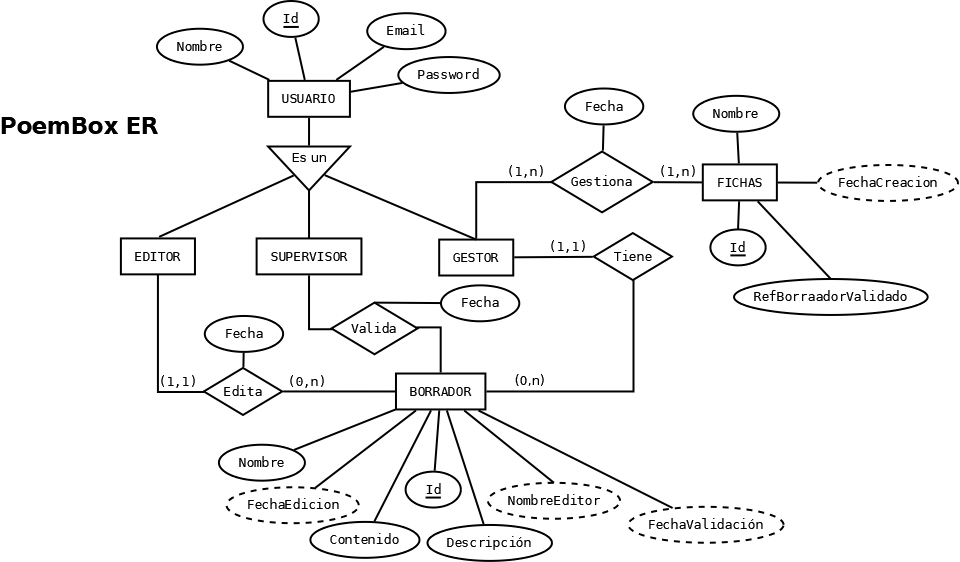

# PoemBox

**PoemBox** es una aplicación Android para poetas y escritores. Permite crear, analizar y gestionar poemas con herramientas de análisis métrico en tiempo real, asistencia por IA y exportación a múltiples formatos.



---

## Características

| Categoría | Funcionalidad |
|-----------|---------------|
| **Editor** | Escritura con contador de palabras, notas por poema y selector de forma poética |
| **Validación de forma** | Verificación en tiempo real de sílabas y esquema de rima (Haiku, Soneto, Redondilla, Décima…) |
| **Análisis métrico** | Conteo de sílabas por verso, rima consonante/asonante, encabalgamiento y esticomitia |
| **IA Gemini** | Sugerencia del siguiente verso respetando ritmo y forma (requiere API key) |
| **Exportación** | PDF con análisis completo · Tarjeta visual PNG para compartir en redes |
| **Gestor de poemas** | Búsqueda, ordenación y eliminación de poemas guardados |
| **Monitor** | Vista de análisis completo con modo lectura inmersiva |
| **Recordatorio diario** | Notificación periódica configurable mediante WorkManager |
| **Estadísticas** | Borradores, poemas validados, palabras escritas y poema más largo |

---

## Stack tecnológico

- **Lenguaje:** Kotlin
- **UI:** Jetpack Compose + Material Design 3
- **Arquitectura:** Clean Architecture + MVVM
- **DI:** Hilt
- **Base de datos:** Room (local, sin servidor)
- **Preferencias:** DataStore
- **Asincronía:** Corrutinas + Flow
- **Background work:** WorkManager
- **IA:** Google Gemini (`generativeai`)
- **Build:** Gradle con Version Catalog (`libs.versions.toml`) + KSP

---

## Arquitectura

El proyecto se divide en tres módulos Gradle:

```
:domain   —  Modelos, interfaces de repositorio y casos de uso (Kotlin puro, sin Android)
:data     —  Room, DAOs, DataStore, mappers e implementaciones de repositorio
:app      —  UI (Compose), ViewModels, DI y workers WorkManager
```

Flujo de dependencias: `:app` → `:domain` ← `:data`

---

## Requisitos

- Android Studio Ladybug o superior
- JDK 17
- API 24+ (minSdk 24, targetSdk 37)

---

## Instalación

```bash
git clone https://github.com/PedroGM80/PoemBox.git
```

1. Abrir en Android Studio
2. Sincronizar Gradle (`Sync Project with Gradle Files`)
3. Ejecutar en dispositivo o emulador con API 24+

> Para usar la sugerencia de verso con IA, introduce tu [Google Gemini API key](https://aistudio.google.com/app/apikey) desde la pantalla de edición → botón IA.

---

## Licencia

Uso personal / educativo. Contactar al autor para distribución.

---

## Autor

**Pedro Gallego Morales** · [@PedroGM80](https://github.com/PedroGM80)

[Descargar APK](https://github.com/PedroGM80/PoemBox/releases/download/PoemBox/PoemBox.apk)
